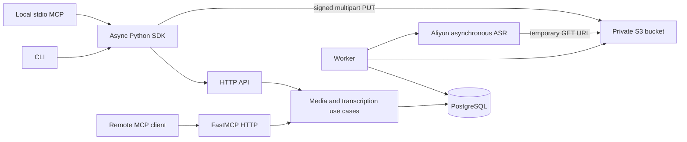

# Architecture

Voice Ingest is a modular Python service for offline audio transcription. HTTP, remote MCP, CLI and
the Python SDK share the same durable jobs. There is no RAG indexing, real-time stream, TTS or tenant
system in this release. All API keys access one trusted workspace.

## Boundaries

Capability packages own their public contracts and behavior. `transcription/contracts.py` and
`media/contracts.py` are importable without server dependencies. `interfaces` translates protocols;
it never owns a second workflow. `runtime` composes dependencies. The CLI and local MCP reuse the
network SDK. A future TTS capability can reuse jobs and storage infrastructure after its own input,
result and provider contracts are defined; no speculative TTS endpoints are included now.

## Upload consistency

An upload allocates an immutable object key and durable asset record before opening an S3 multipart
session. The client hashes files in a thread, uploads at most four 16 MiB chunks concurrently, and
persists only file fingerprints and server upload IDs. The server reads authoritative S3 part lists;
the client never supplies a trusted completion manifest. Completed upload IDs cannot sign new PUTs.

Completion reserves a five-minute operation lease. A retry after a process failure can recover a
finished object by its expected key and metadata. A concurrent completion/abort receives `upload_busy`.
Incomplete uploads expire after 24 hours. S3 lifecycle rules also abort unknown orphan multipart
sessions caused by a crash between opening an S3 session and saving its ID. The worker streams the
completed object to a temporary file, verifies its SHA-256, and runs ffprobe before any paid request.
Temporary audio is removed on normal completion/cancellation; container restart discards its tmp space.

Use dedicated buckets without object versioning for this release's physical-delete semantics. If
versioning is required, add explicit version-aware storage and deletion before enabling it. Buckets
remain private. Configure the internal and public S3 origins independently; signatures are created
with the public origin rather than changing the hostname after signing.

## Durable jobs

The create operation commits `queued` and returns immediately. A short PostgreSQL scheduler-row lock
reserves provider capacity consistently across worker processes. Due job rows use `FOR UPDATE SKIP
LOCKED`; provider I/O and file operations run after the transaction commits. PostgreSQL is mandatory
for production. SQLite is permitted only in explicitly configured unit tests.

Each claim has an owner, lease deadline and increasing generation. Heartbeats renew unexpired leases.
Every task checkpoint checks owner, generation and deadline; a cancelled preparation increments the
generation. Result writes use generation-specific object keys, so stale workers cannot overwrite a
new worker's committed result. Failed-generation objects remain private and are removed by explicit
job-result deletion. Persisted pointers, not a guessed object name, select the authoritative result.

`submitting` is committed **before** sending the provider request. A crash or unknown network outcome
here becomes `needs_attention`. It is never automatically resubmitted. This service guarantees local
request idempotency, not exactly-once provider billing. Explicit acknowledgement is required to create
a new attempt when the prior request may have run. Provider task IDs and attempts are retained.

Known tasks resume polling after restart. HTTP 429 is a retryable rejection; network errors or 5xx
during submission are uncertain outcomes. Poll/download retries use bounded backoff and jitter. The
default deadline is 23 hours to leave margin around provider result retention; it is not an SLA.
Signed source URLs default to 24 hours and must outlive provider queueing and download. Temporary S3
credentials can expire earlier than a requested URL lifetime: deploy with suitable credentials.

Cancellation distinguishes local intent from remote execution. Preparing jobs stop before submission.
Cancellation during submission preserves the returned task ID. Running provider cancellation is best
effort. `remote_may_run` explicitly reports continued execution or billing risk. Known remote jobs are
reconciled after local cancellation/failure so capacity can be released after provider completion.
Unknown submissions reserve capacity until an operator explicitly chooses a retry; that override may
cause concurrent remote work beyond the configured known-job cap.

## Results and errors

Check the **file-level** status, then download and save raw JSON before normalizing. The canonical
transcript uses millisecond offsets in the original audio. Missing or invalid timestamps remain null
and add a warning. Empty ASR results are preserved with `empty_transcript`; a successful transport does
not establish transcript quality. Speaker IDs are scoped to a recording and are not person identities.

JSON, TXT, Markdown, SRT and VTT derive from the same transcript. Subtitle generation fails if any
segment lacks valid timing. Large results are bounded to 32 MiB. MCP reads at most 100 segments at a
time, with optional time-range filtering. The public JSON result is a download, not an MCP tool dump.

Errors contain `code`, `message`, `retryable`, `request_id`. Network, SQL and request-validation errors
are sanitized. HTTP access logs and URL-bearing network logs are disabled. Transcript text, provider
credentials and signed URLs are not emitted in application logs. Raw provider JSON and result URLs
are confidential storage/DB records accessible only to operators of this trusted-workspace service.

## Operations and evolution

The API, worker, PostgreSQL and S3 are separate containers in one Compose project. No Redis, task
broker, workflow engine or Kubernetes is required. Add workers for independent I/O, respecting the
database-enforced provider cap. Health readiness checks migrations/database and bucket access; metrics
report live workers, queue age and current error counts. Readiness does not verify lazy provider
credentials, external signed-URL access or ASR quality.

Use Alembic migrations; never create tables at API startup. Back up PostgreSQL and object data as one
logical dataset. The initial migration is frozen. New schema changes require new revision files.
Revisit durable external workflow engines only if task volume or multi-step workflows justify them.

Official integration references (verified 2026-09-05):

- [Aliyun ASR HTTP API](https://help.aliyun.com/zh/model-studio/fun-asr-recorded-speech-recognition-http-api)
- [Aliyun model limits](https://help.aliyun.com/zh/model-studio/asr-model/)
- [FastMCP 4 migration guide](https://gofastmcp.com/getting-started/upgrading/from-fastmcp-3)
- [S3 multipart upload](https://docs.aws.amazon.com/AmazonS3/latest/userguide/mpuoverview.html)

## Optional browser workspace

`web/` is a React SPA served separately from the Python package. It consumes generated OpenAPI types
and the existing `/v1` API; there is no parallel job state machine. Same-origin `/api` proxies keep
service authentication simple. Presigned uploads go directly to S3 and require storage-side CORS.
Service credentials are held in page memory, and TanStack Query caches are cleared on workspace
changes. A Web Worker hashes bounded file chunks. Browser resume records contain only identifiers
and digests, and submission idempotency is persisted before creating a job. The default interactive
preview uses explicitly labeled synthetic fixtures and never sends user audio to a cloud provider.

## Provider-readable source preparation

The worker uses a small `SourcePreparer` boundary after media validation and before the durable
`submitting` checkpoint. The default `signed_url` strategy signs the confirmed private S3 object.
An explicit `temporary_upload` strategy supports local Aliyun evaluation when S3 is not publicly
reachable: it stages the object through disk and a streaming upload to the official temporary store.
The upload runs outside database transactions and off the event loop so lease heartbeats continue.
Only the policy endpoint receives the model API key; storage requests never receive it.

Staging failures can retry without repeating a billable ASR submission. Existing cancellation and
generation fences still gate submission, and uncertain submission outcomes retain `needs_attention`.
Each attempt records its source mode. Temporary storage is not a production transport; production
continues to require provider-accessible signed S3 URLs.
